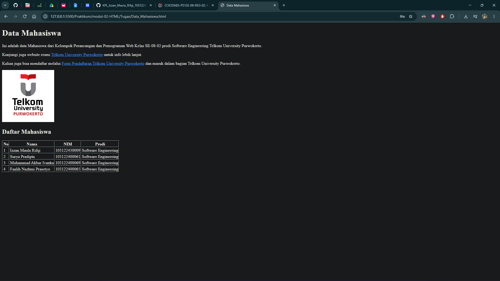
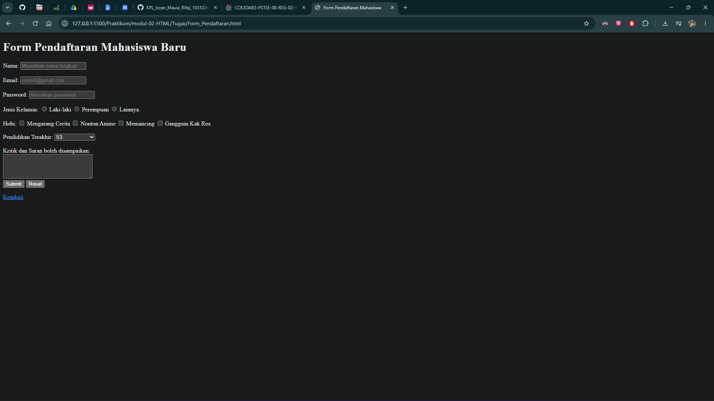

# Tugas Praktikum 02: HTML

**Nama:** Izzan Maula Rifqi  
**NIM:** 103122430009  
**Kelas:** SE-08-02  
**Dosen Pengampu:** Arif Amrulloh  

## Soal
**Soal 1 - Halaman Data Mahasiswa**  
Buatlah sebuah halaman HTML sederhana dengan ketentuan berikut:
1. Memiliki judul halaman menggunakan heading.
2. Menampilkan satu paragraf singkat.
3. Menambahkan satu hyperlink menuju website lain.
4. Menampilkan satu gambar menggunakan elemen image.
5. Membuat tabel berisi minimal 3 baris data dan 3 kolom.
Tema: Data Mahasiswa.

**Soal 2 - Form Pendaftaran Mahasiswa**  
Buatlah sebuah form pendaftaran mahasiswa menggunakan HTML dengan komponen berikut:
1. Input Nama.
2. Input Email.
3. Input Password.
4. Pilihan Jenis Kelamin menggunakan radio button.
5. Pilihan Hobi menggunakan checkbox.
6. Pilihan Pendidikan menggunakan dropdown.
7. Kolom Kritik dan Saran menggunakan textarea.
8. Tombol Submit.

Gunakan elemen <label> pada setiap input agar form lebih mudah digunakan dan mendukung
aksesibilitas dasar.

## Program/Kode
Tersedia di [Data_Mahasiswa.html](Data_Mahasiswa.html) dan [Form_Pendaftaran.html](Form_Pendaftaran.html)

## Output

## Deskripsi
Pada praktikum ini saya membuat dua halaman HTML. Halaman pertama (`Data_Mahasiswa.html`) berisi tampilan data mahasiswa yang terdiri dari heading sebagai judul, paragraf singkat, hyperlink menuju website lain, gambar menggunakan elemen ``, serta tabel yang menampilkan data mahasiswa dengan 3 baris dan 3 kolom.

Halaman kedua (`Form_Pendaftaran.html`) berisi form pendaftaran mahasiswa yang terdiri dari input nama, email, dan password, pilihan jenis kelamin menggunakan `radio button`, pilihan hobi menggunakan `checkbox`, pilihan pendidikan terakhir menggunakan `dropdown`, kolom kritik dan saran menggunakan `textarea`, serta tombol `submit`. Setiap input pada form sudah diberi elemen `<label>` yang dihubungkan menggunakan atribut `for` dan `id` supaya form lebih mudah digunakan dan mendukung aksesibilitas dasar, misalnya saat label diklik maka input terkait akan otomatis terfokus.