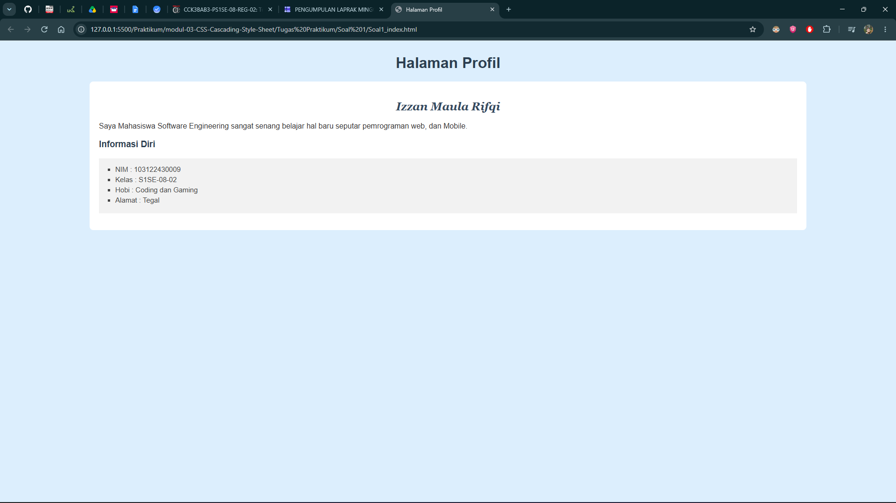
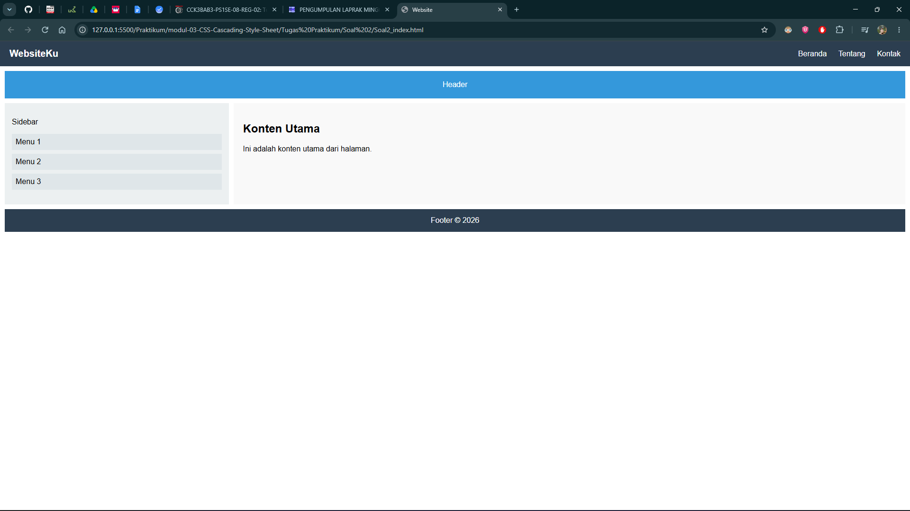

# LAPORAN PRAKTIKUM

*Disusun untuk memenuhi Tugas Laporan Praktikum Mata Kuliah Perancangan dan Pemrograman Web*

  

  

**Disusun oleh :**

| Nama | NIM |
|---|---|
| Izzan Maula Rifqi | 103122430009 |

  

### PROGRAM STUDI S1 SOFTWARE ENGINEERING
### TELKOM UNIVERSITY PURWOKERTO

### 2026 / 2027

 

---

# Laporan Praktikum 03: CSS

**Nama:** Izzan Maula Rifqi  
**NIM:** 103122430009  
**Kelas:** SE-08-02  
**Dosen Pengampu:** Arif Amrulloh  

## Soal
Kerjakan kedua latihan berikut menggunakan HTML dan CSS. Buat file index.html dan gunakan CSS sesuai materi yang telah dipelajari (Selector, Font Properties, List, Alignment, Color, Div & Span, Flexbox, Grid, dan Responsive Design).   
**Soal 1 - Membuat Halaman Profil Sederhana dengan CSS**  
Buat sebuah halaman profil sederhana menggunakan HTML dan CSS dengan ketentuan berikut:
1. Buat judul halaman menggunakan heading dan atur menggunakan CSS Selector.
2. Buat bagian profil menggunakan elemen. 

3. Gunakan Font Properties untuk mengatur:
   - jenis font
   - ukuran teks
   - ketebalan teks
   - gaya teks
4. Buat daftar informasi menggunakan list (`<ul>` atau `<ol>`) dan berikan styling CSS.
5. Atur warna background dan warna teks menggunakan CSS Colors.
6. Atur posisi teks menggunakan Text Alignment.

Output yang diharapkan:  
Terdapat halaman profil dengan judul, deskripsi, daftar informasi, dan tampilan yang sudah diberi styling CSS.   
**Soal 2 - Membuat Layout Website Responsive**  
Buat sebuah layout website sederhana menggunakan Flexbox, CSS Grid, dan Responsive Design dengan ketentuan berikut:
1. Buat navbar yang berisi minimal tiga menu menggunakan Flexbox.
2. Buat layout halaman yang terdiri dari:
   - Header
   - Sidebar
   - Konten utama
   - Footer
3. Gunakan CSS Grid untuk mengatur struktur layout halaman.
4. Tambahkan warna, padding, dan jarak antar elemen agar tampilan lebih rapi.
5. Gunakan Media Query agar tampilan berubah ketika dibuka pada layar tablet dan smartphone.  

Ketentuan responsive:
- Desktop: tampilkan menu secara horizontal dan layout beberapa kolom.
- Tablet: sesuaikan ukuran kolom agar lebih kecil.
- Mobile: ubah tampilan menjadi satu kolom dan menu menjadi vertikal.

Output yang diharapkan:
- Website sederhana yang dapat menyesuaikan tampilan pada laptop, tablet, dan smartphone. 

**Keterangan Pengumpulan**  
Kumpulkan file project HTML dan CSS yang telah dibuat.
Pastikan kode dapat dijalankan menggunakan browser atau Live Server pada Visual Studio Code.

## Program/Kode
Soal 1 tersedia di [Soal1_index.html](<Soal 1/Soal1_index.html>) dan [Soal1_style.css](<Soal 1/Soal1_style.css>). 
Soal 2 tersedia di [Soal2_index.html](<Soal 2/Soal2_index.html>) dan [Soal2_style.css](<Soal 2/Soal2_style.css>).

## Output

## Deskripsi
**Soal 1** membuat halaman profil sederhana yang terdiri dari judul menggunakan heading yang diatur dengan CSS `selector`, bagian profil yang dibungkus dengan elemen `
`, penerapan `font properties` seperti `font-family`, `font-size`, `font-weight`, dan `font-style`, daftar informasi diri menggunakan `<ul>` yang sudah diberi styling, serta pengaturan warna menggunakan `background-color` dan `color`, dan perataan teks menggunakan `text-align`.  
**Soal 2** membuat layout website sederhana yang responsive. Bagian navbar dibuat menggunakan `flexbox` dengan tiga menu navigasi, sedangkan struktur layout halaman yang terdiri dari header, sidebar, konten utama, dan footer diatur menggunakan `CSS Grid` melalui `grid-template-areas`. Setiap bagian sudah diberi warna, padding, dan jarak antar elemen agar tampilan lebih rapi. Untuk membuat tampilan responsive, lebih bagus menggunakan `media query` dengan dua breakpoint, yaitu pada ukuran tablet layout kolom menjadi lebih kecil, dan pada ukuran mobile layout berubah menjadi satu kolom serta menu navbar berubah menjadi vertikal.  
Praktikum kali ini berfokus pada cara mengatur tampilan halaman web menggunakan CSS, mulai dari `selector`, `font properties`, `list`, `alignment`, hingga `colors`, serta bagaimana membangun layout halaman yang fleksibel dan responsive menggunakan kombinasi `flexbox`, `CSS Grid`, dan `media query` agar tampilan website dapat menyesuaikan berbagai ukuran layar.